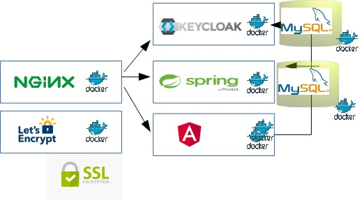

# todo-api

# Context

The software allows managing a TODO list of tasks secured by user/password. It also allows completing and removing the activities already done. 

# Description

The TODO List software is prepared for production with the following architecture (letsencrypt for https). The repository includes a token-based backend to provide the functionality but also a ready-for-production deployment. An angular application adapted [from this SitePoint example](https://www.sitepoint.com/angular-2-tutorial/) is used to access the API REST. A login page has been implemented to validate through the Identity Management (KeyCloak):



Nginx is used as reverse proxy. For testing, port 80 and simple names are used: keycloak, todo-api and todo-ui. For production the port must be changed to 443, letsencrypt to provide the certs including suitable domains. There are several files to be changed for configuration purposes:
- Change acordingly the .env file before deploying the docker-compose.
- Check the resources/application.yml from the Spring REST API
- Check the src/environment/environment.ts (and environment-prod.ts) files for the Angular connection to REST API
- To avoid CORS (see below) modify the file 
```
    todo-backend/src/java/main/src/com/example/todo/controller/TodoController.java 
```

# Technologies

- Eclipse.
- Angular2.
- Spring Boot REST API
- Swagger
- KeyCloak
- MySQL
- Nginx as reverse proxy and letsencrypt

Spring profiles have been used to differentiate between test and production. Run:
```
	mvn spring-boot:run -Dspring.profiles.active=local
```
to deploy a MySQL database for persistence storage.

# How to compile

To compile the backend API REST Maven is used

```
	cd todo-backend/
	mvn clean install
```

The same to compile the angular frontend. Maven parent is used:

```
	cd todo-frontend/
	mvn clean install
```

# How to deploy

Deploy directly the Spring API REST application:

```
	cd todo-backend/
	mvn spring-boot:run
```

**IMPORTANT** To avoid CORS error between the frontend and the backend modify the controller/TodoController.java before compiling including the following:
```
   @CrossOrigin(origins = "<frontend url>", maxAge = 3600)
   public class TodoController
```

Deploy directly the angular frontend:
```
	cd todo-frontend/
	mvn clean install
	java -jar todo-frontend/todo-frontend-spring/target/todo-frontend-0.0.1-SNAPSHOT.jar
```

Deploy using docker-compose:

```
Stop and remove the containers
docker-compose down

Launch the containers (dettached)
docker-compose up -d
```

# How to use

API REST Swagger can be accessed on:

```
	http://localhost:8081/swagger-ui.html
```

Generate the token with the login function and include the Authorization Http Header with "BEARER <token>" in the rest of the calls.

Angular frontend can be accessed through:
```
	http://localhost:8082/
```

You need to validate with user and password. 

**IMPORTANT!** Login to KeyCloak (See the .env file -> user: admin password: Pa55w0rd). Create a realm "test", with a client id "test" in KeyCloak. Be sure to fill in Valid Redirect URI to http://localhost:8080/* (or http://keycloak/*). Create a user in the new realm for testing, for instance (test).
```
	http://localhost:8080/ (or http://keycloak/)
```

The nginx reverse proxy allows also accessing using domains: todo-api, todo-ui and keycloak (if you redirect the domains to localhost or the IP where you are deploying the containers).

# How to contribute

Features and bug fixes are more than welcome. They must be linked to an issue, so the first step before contributing is the creation of a [GitHub issue](https://github.com/carloscaverobarca/todo-api/issues).

# External resources

- [Angular TODO application by SitePoint tutorial](https://www.sitepoint.com/angular-2-tutorial/) and the corresponding [GitHub repo](https://github.com/sitepoint-editors/angular-todo-app/tree/master/src/app)

# License

Apache 2.0.